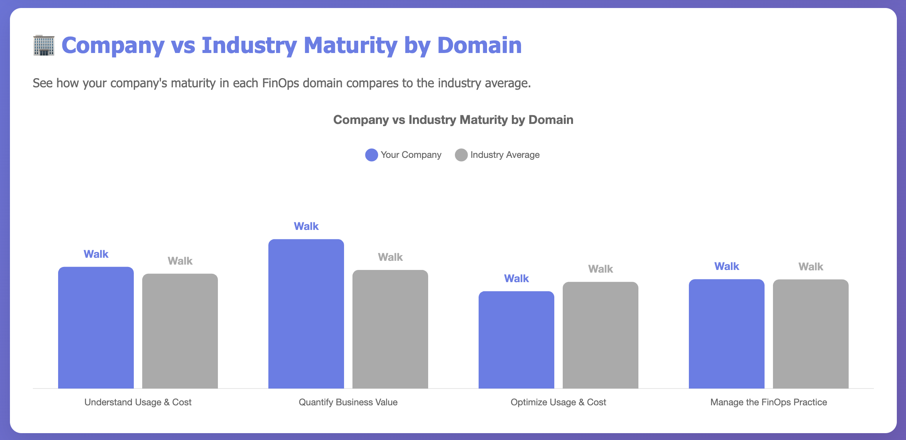
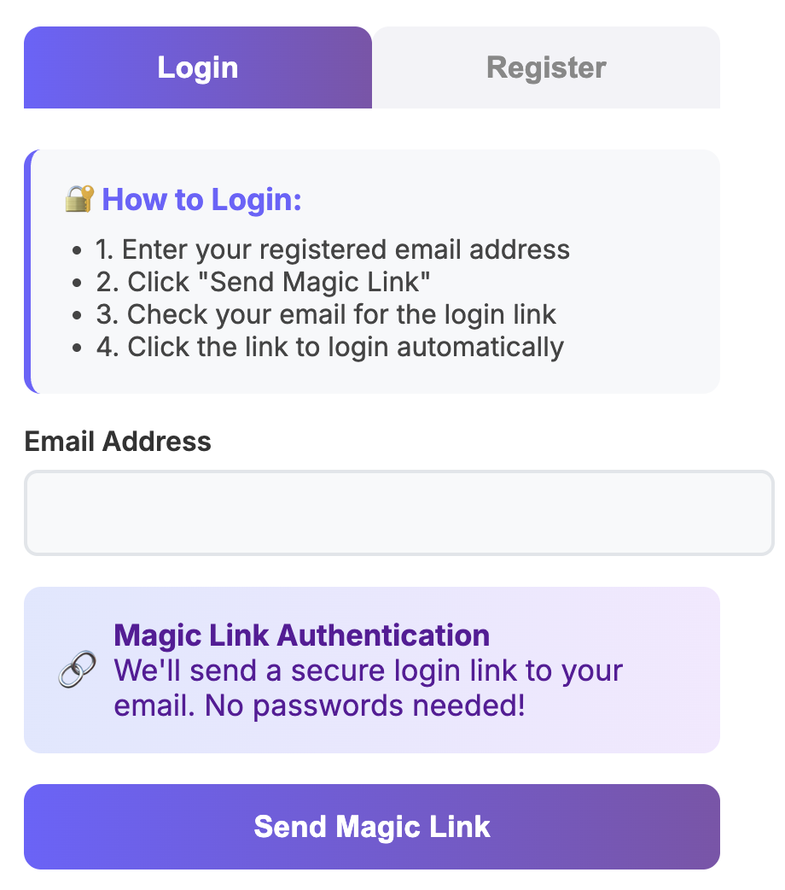
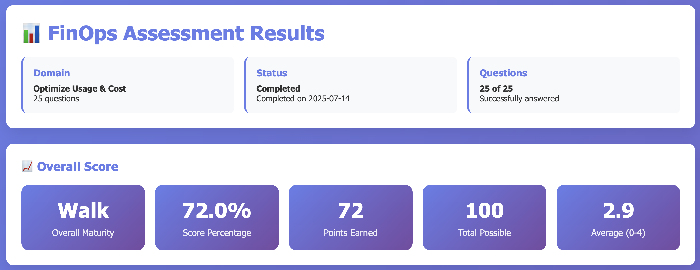
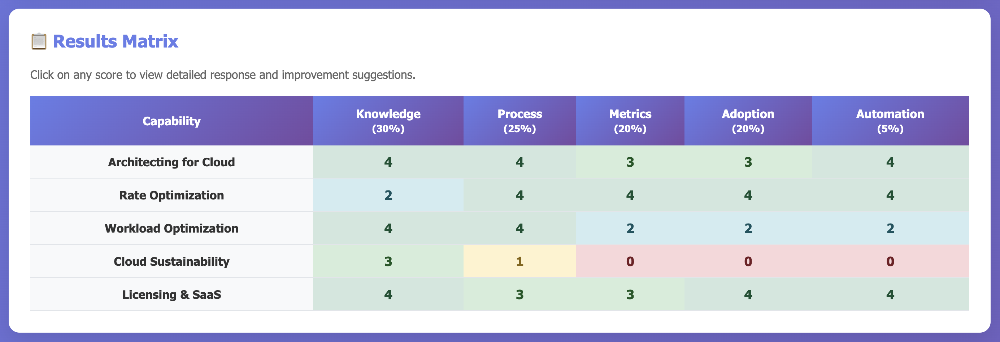
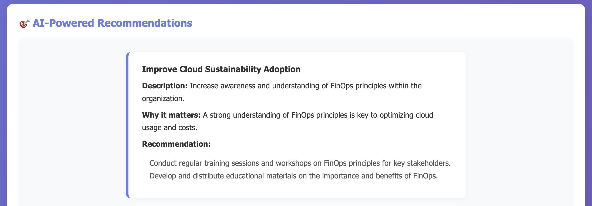

[](https://buymeacoffee.com/uli6)

*If you find this project helpful, consider supporting it!*

If you want to use the production version, access: [https://finopsassessment.duckdns.org/](https://finopsassessment.duckdns.org/)

# FinOps Assessment Platform

## 🚀 AI-Powered, Privacy-First FinOps Maturity Assessment

The FinOps Assessment Platform is a modern, privacy-focused solution for evaluating and improving your organization's FinOps maturity. Leveraging advanced AI, it delivers actionable insights, anonymized benchmarking, and beautiful, professional reports.

---

## 📊 At a Glance


*Dashboard: Instantly compare your company's maturity to the industry across all FinOps domains.*

---

## ✨ Key Features
- **Privacy-First:** Company names are anonymized and encrypted; emails are hashed. No personal data stored in plaintext.
- **AI-Powered Recommendations:** Get contextual, actionable suggestions for every assessment.
- **Comprehensive Benchmarking:** See how your organization compares to the industry in every FinOps domain.
- **Professional Reporting:** Export beautiful PDF and Excel reports with AI-generated insights.
- **Magic Link Authentication:** Secure, passwordless login for a seamless experience.
- **Responsive UI:** Works great on desktop and mobile.

---

## 🖼️ Visual Tour

### 🔐 Login & Magic Link

*Secure, passwordless login with email magic link.*

### 📝 Start a New Assessment

*Choose a domain or complete assessment to begin.*

### 📈 Company vs Industry Benchmark

*Visualize your company's maturity against the industry for each FinOps domain.*

### 🧮 Results Matrix

*Detailed matrix of your scores by capability and lens, with drill-down for improvement suggestions.*

### 🤖 AI-Powered Recommendations

*Personalized, actionable recommendations generated by AI for your organization.*

---

## 🛠️ How It Works
1. **Register & Login:** Use your corporate email to register. Confirm via magic link.
2. **Start Assessment:** Select a domain or complete assessment. Answer questions for each capability and lens.
3. **Get Insights:** Instantly see your maturity level, benchmarks, and AI-powered recommendations.
4. **Export Reports:** Download professional PDF or Excel reports for sharing and tracking progress.

## 🚀 Deployment

### For Open Source Contributors
This repository contains the application code and CI workflows. For deployment:

1. **Fork this repository**
2. **Create a private deployment repository** (see `deploy/README.md`)
3. **Configure your own deployment secrets**
4. **Use the provided deployment templates**

### For Production Use
- **Production URL:** [https://finopsassessment.duckdns.org/](https://finopsassessment.duckdns.org/)
- **Deployment:** Automated via GitHub Actions (private repository)
- **Infrastructure:** AWS EC2 with Gunicorn and Nginx

---

## ⚡ Quick Start

### Prerequisites
- Python 3.8+
- pip
- OpenAI API key
- Email credentials (for magic link login)

### Installation
```bash
git clone <repository-url>
cd finops-assessment
python -m venv venv
source venv/bin/activate
pip install -r requirements.txt
```

### Configuration
Set your environment variables (see `.env.example`):
- `EMAIL_USER`, `EMAIL_PASS`, `SMTP_SERVER`, `SMTP_PORT`
- `OPENAI_API_KEY`

### Run the App
```bash
python app.py
```
Visit [http://localhost:5002](http://localhost:5002) in your browser.

---

## 🔒 Security & Privacy
- **No plaintext emails or company names stored.**
- **All sensitive data encrypted at rest.**
- **Users from the same email domain are grouped as a single company for benchmarking.**
- **Magic link authentication for secure, passwordless access.**

---

## 🗂️ Project Structure
```
finops-assessment/
├── app.py
├── requirements.txt
├── finops_assessment.db
├── routes/
├── services/
├── models/
├── data/
├── templates/
├── screenshots/
└── ...
```

---

## 🏗️ Tech Stack
- **Backend:** Flask, SQLite, OpenAI, Cryptography
- **Frontend:** HTML, CSS, JavaScript, Chart.js
- **Reporting:** WeasyPrint (PDF), OpenPyXL (Excel)

---

## 🤝 Contributing
Pull requests are welcome! For major changes, please open an issue first to discuss what you would like to change.